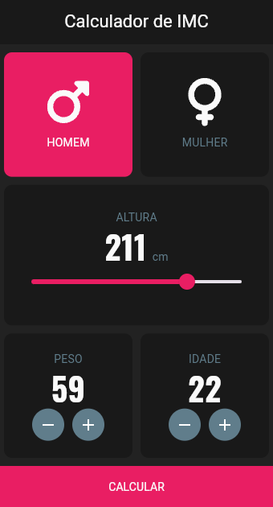
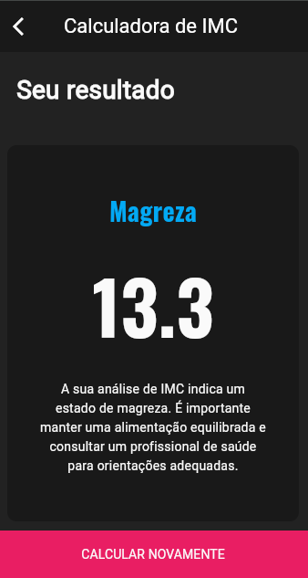

# Calculadora de IMC

Esta é uma aplicação simples que calcula o Índice de Massa Corporal (IMC) e fornece uma análise categorizada com base no resultado. O IMC é uma medida amplamente utilizada para avaliar se uma pessoa está em um peso saudável para sua altura.

## Imagens

<div style="display: flex; flex-wrap:wrap; gap: 10px; justify-content: center">


</div>


## Funcionalidades

- Cálculo do IMC com base na altura e peso do usuário.
- Classificação do IMC em categorias: Magreza, Peso Normal, Sobrepeso, Obesidade I, Obesidade II e Obesidade III.
- Exibição de mensagens informativas e sugestões de saúde para cada categoria.
- Interface amigável com cores que ajudam na visualização das categorias.

## Tecnologias Utilizadas

<div style="display: flex; justify-content: center ; width: 100%"
style="margin: 0 auto; width: 100%">
 
 
</div>

## Estrutura do Projeto

- `lib/`: Contém o código fonte da aplicação.
  - `main.dart`: Ponto de entrada da aplicação.
  - `imc_data.dart`: Define a classe `ImcData` que representa os dados de cada categoria de IMC.

## Classes de Dados

Aqui está a versão aprimorada da descrição:

A classe ImcData foi desenvolvida para encapsular as informações relacionadas aos diferentes tipos de IMC. Cada instância da classe armazena dados como:

- Nome: O nome da categoria de IMC.

`'Magreza', 'Peso Normal', 'Sobrepeso', etc.`
- Intervalo: A faixa de valores de IMC que define essa categoria

`'Menor que 18.5', '18.5 - 24.9'.`
- Descrição: Um texto explicativo que fornece orientações ou informações sobre o que essa categoria representa em termos de saúde e possíveis ações recomendadas.

- Cor: Uma cor visualmente associada ao nível de risco, facilitando a identificação das diferentes categorias de IMC.

Esses campos permitem que o aplicativo apresente o status de IMC de uma forma clara e visual, ajudando os usuários a entender sua condição de saúde com base em seus resultados de IMC.

### Estrutura da classe

```dart
import 'package:flutter/material.dart';

class ImcData {
  final String nome;
  final String valor;
  final String descricao;
  final Color cor;

  ImcData({
    required this.nome,
    required this.valor,
    required this.descricao,
    required this.cor,
  });
} 
```

## Contribuições

Contribuições são bem-vindas! Sinta-se à vontade para abrir issues ou enviar pull requests para melhorias e novas funcionalidades.

## Licença

Este projeto está licenciado sob a [MIT License](LICENSE).

## Contato

Se tiver dúvidas ou sugestões, sinta-se à vontade para entrar em contato através de:

- **Email**: [liedson.b9@gmail.com](mailto:liedson.b9@gmail.com)
- **LinkedIn**: [liedsonlb](https://linkedin.com/in/liedsonlb)
- **Instagram:** [liedson.vue](https://www.instagram.com/liedson.vue)
- **Github:** [LiedsonLB](https://github.com/LiedsonLB)
- **Portfólio:** [Liedson Barros](https://liedsonbarros.vercel.app)

## Releases

- Release v1.0 ✅